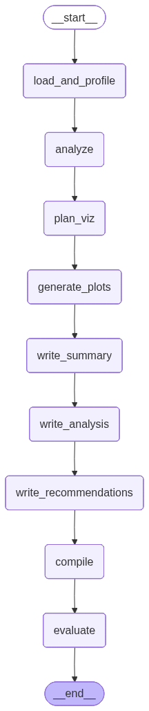

# Sales Analysis - LLM-Powered Automated Report Generation

An intelligent reporting system that uses **LangGraph** and **LLMs** to automatically analyze BMW sales data and generate comprehensive business reports in multiple formats (PDF, HTML, Word, Markdown). The system orchestrates a multi-agent workflow where LLM agents collaborate to extract insights, plan visualizations, write reports, and evaluate quality. A synthetic BMW dataset is used for demo. 

## How It Works

The application uses a **LangGraph-based agent orchestration** workflow to process sales data through multiple intelligent stages:



The workflow consists of the following stages:

1. **Data Loading & Profiling**: Loads and validates sales data with automatic column mapping
2. **LLM Analysis**: Extracts key business insights using configured LLM provider
3. **Visualization Planning**: LLM agents plan appropriate visualizations based on data characteristics
4. **Plot Generation**: Creates plots based on LLM-generated specifications
5. **Report Writing**: LLM agents write executive summary and detailed analysis sections
6. **Report Compilation**: Assembles final reports in multiple formats (PDF, HTML, Word, Markdown)
7. **Quality Evaluation**: Automated assessment of report quality and completeness

For detailed information about the agent orchestration flow, see [`agent_orchestration_flow.ipynb`](agent_orchestration_flow.ipynb).  
View a sample report generated: [`sample_report.pdf`](sample_report.pdf)

## Features

- 🤖 **LLM-Powered Analysis**: Uses LangGraph for stateful orchestration of LLM workflows
- 📊 **Automated Insights**: Extracts key business insights from sales data
- 📈 **Smart Visualizations**: Generates relevant plots based on data analysis
- 📄 **Multi-Format Reports**: Exports reports in PDF, HTML, Word, and Markdown
- 🎨 **Interactive UI**: Streamlit-based web interface for easy data upload and report generation
- ⚙️ **Flexible Configuration**: Type-safe settings management with pydantic-settings
- 🔍 **Quality Evaluation**: Automated report quality assessment


## Technology Stack

- **LangGraph**: Stateful LLM orchestration
- **LangChain**: LLM integration framework
- **Streamlit**: Interactive web UI
- **Pydantic-Settings**: Type-safe configuration management
- **ReportLab**: PDF generation
- **Pandas**: Data processing
- **Matplotlib/Seaborn**: Visualization

## Installation & Usage

### Prerequisites

- **Python 3.10+**
- **uv** (Python package manager) - [Installation instructions](https://github.com/astral-sh/uv)
- **Ollama** (for local LLM) or API keys for cloud providers (OpenAI, Anthropic, Google Gemini)

### Option 1: Using uv (Recommended)

The recommended way to run the application is using `uv`:

1. **Clone the repository:**
```bash
git clone https://github.com/Stoic-Carp/llm-report-generation.git
cd llm-report-generation
```

2. **Install uv** (if not already installed):
```bash
curl -LsSf https://astral.sh/uv/install.sh | sh
```

3. **Install dependencies:**
```bash
uv sync
```

4. **Configure environment variables:**
```bash
# Create .env file or export variables
export LLM_PROVIDER=ollama
export LLM_MODEL=granite4:latest
export OLLAMA_HOST=http://localhost:11434

# Or use cloud providers (set API keys)
# export GEMINI_API_KEY=your_key_here
# export ANTHROPIC_API_KEY=your_key_here
# export OPENAI_API_KEY=your_key_here
```

5. **Set up Ollama** (if using local LLM):
```bash
# Install Ollama from https://ollama.ai
ollama pull granite4:latest
ollama serve  # Start Ollama server
```

6. **Run the application:**

   **Recommended: Run via CLI:**
   ```bash
   uv run main.py 
   ```

   **Or run the Streamlit UI:**
   ```bash
   uv run streamlit run streamlit_app/app.py
   ```
   Then open your browser to `http://localhost:8501` to upload data and configure settings.

### Option 2: Using Docker Compose (Alternative)

For containerized deployment:

1. **Clone the repository:**
```bash
git clone <repository-url>
cd llm-report-generation
```

2. **Create a `.env` file** (optional, defaults are provided):
```bash
# LLM Configuration (Ollama is included in docker-compose)
LLM_PROVIDER=ollama
LLM_MODEL=granite4:latest
# OLLAMA_HOST is automatically set to http://ollama:11434 in docker-compose

# Or use cloud providers (set API keys)
# GEMINI_API_KEY=your_key_here
# ANTHROPIC_API_KEY=your_key_here
# OPENAI_API_KEY=your_key_here
```

   **Note**: Ollama and the required model are automatically set up by docker-compose. The `ollama-init` service will pull the model on first startup.

3. **Prepare directories and fix permissions (REQUIRED):**
```bash
# Create outputs directory structure (required for report generation)
mkdir -p outputs/logs outputs/plots outputs/reports

# Fix permissions so the container can write to outputs
# Option 1: Use the provided script (recommended)
./scripts/fix-permissions.sh

# Option 2: Manual fix (if script doesn't work)
sudo chown -R 1000:1000 outputs
# OR (less secure but works)
sudo chmod -R 777 outputs
```

   **Important**: You must fix permissions before running docker-compose, otherwise the `permission-check` service will fail and prevent the app from starting.

4. **Build and run with Docker Compose:**

   **Option A: Use the wrapper script (recommended - auto-fixes permissions):**
   ```bash
   # Automatically fixes permissions and starts docker-compose
   ./scripts/docker-compose-up.sh up --build
   
   # Or in detached mode
   ./scripts/docker-compose-up.sh up -d
   ```

   **Option B: Use docker-compose directly (permissions checked automatically):**
   ```bash
   # Build and start all services (Ollama + App)
   # Note: A permission-check service will verify permissions before starting
   docker-compose up --build
   
   # Or run in detached mode
   docker-compose up -d
   
   # View logs
   docker-compose logs -f
   ```

   The docker-compose setup includes a `permission-check` service that automatically verifies write permissions before starting the app. If permissions are wrong, it will show clear error messages with fix instructions.

5. **Access the application:**
   - Open your browser to `http://localhost:8501`
   - Upload your BMW sales Excel file
   - Configure LLM settings in the sidebar
   - Run analysis and download reports

**Notes:**
- **Ollama is included**: The docker-compose setup includes an Ollama service that automatically starts and pulls the required model (`granite4:latest` by default). No manual setup needed!
- **Outputs directory permissions**: The `./outputs` directory is mounted as a volume. If you encounter permission errors when generating plots or reports, run `./fix-permissions.sh` or manually fix permissions:
  ```bash
  sudo chown -R 1000:1000 outputs
  # OR
  sudo chmod -R 777 outputs
  ```
  The container runs as user UID 1000, so the host directory must be writable by that user.
- **File logging**: File logging is disabled by default in Docker (logs are available via `docker logs`). To enable file logging, set `LOGGING__LOG_TO_FILE=true` in your `.env` file and ensure `./outputs/logs` directory exists and is writable.
- **Model customization**: To use a different Ollama model, set `LLM_MODEL` in your `.env` file (e.g., `LLM_MODEL=llama3.1:8b`).
- **Ollama host**: The `OLLAMA_HOST` is automatically configured to use the internal Docker service name (`http://ollama:11434`). If you need to override it, set `LLM__OLLAMA_HOST` in your `.env` file (note the double underscore for nested settings).

### Usage Workflow

1. **Upload Data**: Upload your BMW sales Excel file through the Streamlit UI
2. **Configure Settings**: Adjust LLM provider, model, temperature, and output formats in the sidebar
3. **Run Analysis**: The workflow runs automatically after upload, or click "Re-run Analysis" to regenerate
4. **View Results**: 
   - Review insights and analysis sections
   - Browse generated visualizations
   - Download reports in your preferred format (PDF, HTML, Word, Markdown)
5. **Evaluate Quality**: Check the evaluation metrics for report quality assessment

## Configuration

Configuration is managed through **pydantic-settings** with environment variables. Key settings:

### LLM Settings
- **LLM_PROVIDER**: Choose from `ollama`, `gemini`, `anthropic`, or `openai`
- **LLM_MODEL**: Specific model name for the provider (e.g., `granite4:latest`, `gpt-4o`, `claude-3-5-sonnet-20241022`)
- **LLM_TEMPERATURE**: Controls randomness (0.0-2.0, default: 0.7)
- **LLM_MAX_TOKENS**: Maximum tokens for generation (default: 4096)
- **OLLAMA_HOST**: Ollama server URL (default: `http://localhost:11434`)

### API Keys (for cloud providers)
- **GEMINI_API_KEY**: Google Gemini API key
- **ANTHROPIC_API_KEY**: Anthropic Claude API key
- **OPENAI_API_KEY**: OpenAI API key

### Report Settings
- **REPORT_GENERATE_PDF**: Enable PDF generation (default: `true`)
- **REPORT_GENERATE_HTML**: Enable HTML generation (default: `true`)
- **REPORT_GENERATE_WORD**: Enable Word document generation (default: `false`)
- **REPORT_GENERATE_MARKDOWN**: Enable Markdown generation (default: `true`)

### Application Settings
- **ENVIRONMENT**: Environment mode (`development`, `production`, default: `production`)
- **DEBUG**: Enable debug mode (default: `false`)

See `docker-compose.yml` for all available configuration options, or check `config/settings.py` for the full settings schema.

## Project Structure

```
llm-report-generation/
├── config/              # Configuration management
├── src/
│   ├── data/           # Data loading and analysis
│   ├── llm/            # LangGraph workflow and LLM integration
│   ├── visualization/  # Plot generation
│   ├── reporting/      # Report compilation
│   ├── evaluation/     # Quality assessment
│   └── utils/          # Utilities
├── streamlit_app/      # Streamlit UI
├── tests/              # Test suite
└── outputs/            # Generated reports and plots
```

## Data Format

Expected Excel file format:

| Column | Description | Required |
|--------|-------------|----------|
| date | Date of sale | Yes |
| region | Region code (NA, EU, ASIA, LATAM, MEA) | Yes |
| model | Car model name | Yes |
| sales | Number of units sold | Yes |
| price | Unit price | Yes |

## Testing

Run the test suite:

```bash
uv run pytest -v # if you are using uv
```

With coverage:

```bash
pytest tests/ --cov=src --cov-report=html
```
